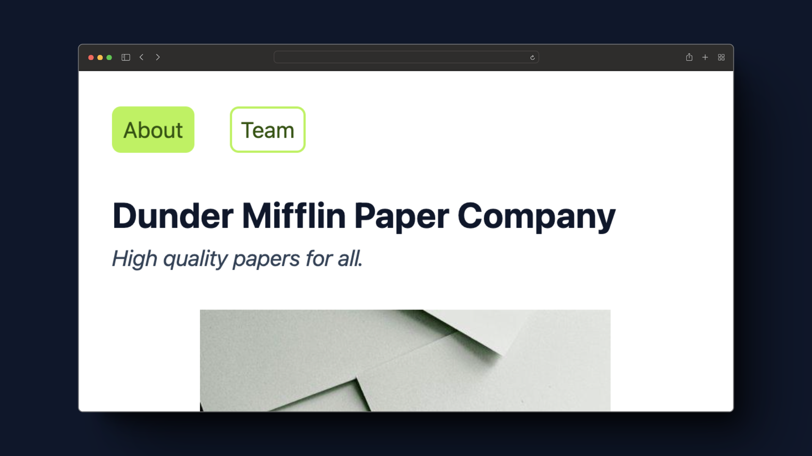
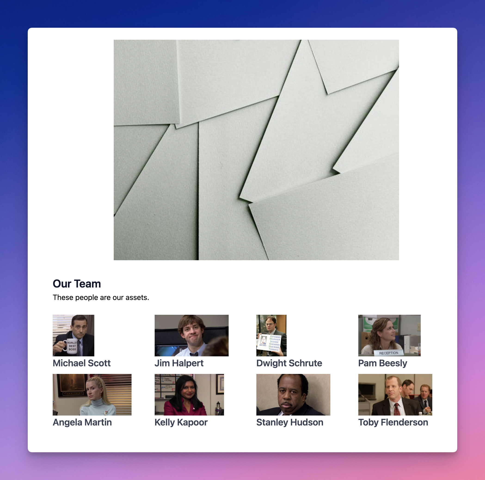

## a Day 2

### Task 1, Setup a new Vue Project

Follow the instructions [here](https://vuejs.org/guide/quick-start.html#creating-a-vue-application) and setup a new Vue SPA project.

You can name it whatever you like. Cleanup the project by:

1. Removing everything in `App.vue` file
1. Deleting all other components except `App.vue` (check `components` directory)
1. Deleting the CSS import from `main.js` file
1. Delete the CSS file that was getting imported in `main.js` file

### Task 2, Add TailwindCSS to the Project

Visit [this](https://tailwindcss.com/docs/guides/vite#vue) link and follow the instructions to setup TailwindCSS in your VueJS project.

> Note: if you are using VSCode, install the TailwindCSS Extension! ([link](https://marketplace.visualstudio.com/items?itemName=bradlc.vscode-tailwindcss))

### Task 3, Switch it up



Copy the below code to your `App.vue` file and rewrite it using Tailwind classes:

```vue
<template>
  <nav>
    <ul>
      <li>
        <button class="active">About</button>
      </li>
      <li>
        <button>Team</button>
      </li>
    </ul>
  </nav>

  <!-- ABOUT SECTION -->
  <div class="section hero">
    <h1 class="hero-text">Dunder Mifflin Paper Company</h1>
    <p>High quality papers for all.</p>

    
  </div>

  <!-- TEAM SECTION -->
  <div class="section">
    <h2 class="section-heading">Our Team</h2>
    <p>These people are our assets.</p>
    
    <div>
      <!-- LIST OF PEOPLE GO HERE -->
    </div>
  </div>
</template>

<script setup>
import { ref } from 'vue';

const currentTab = ref("about"); // can be "about" or "team"
</script>

<style scoped>
nav {
  margin: 2rem;
}

nav ul {
  display: flex;
}

nav ul li {
  margin-right: 2rem;
}

nav ul li button {
  border: 2px solid #bef264;
  color: #365314; /* lime 900 */
  padding: 4px 8px;
  border-radius: 8px;
  font-size: 1.25rem;
}

.active {
  background-color: #bef264; /* lime 300 */
}

nav ul li button:hover {
  background-color: #65a30d; /* lime 600 */
  color: #ecfccb;
  transition: all;
}

.section {
  margin: 2rem;
}

.hero-text {
  font-weight: 700;
  color: #0f172a; /* slate 900 */
  font-size: 2rem;
}

.hero-image {
  width: 70%;
  margin: 32px auto;
}

.hero p {
  font-style: italic;
  font-size: 1.25rem;
  color: #334155; /* slate 700 */
}

.section-heading {
  font-weight: 600;
  color: #0f172a; /* slate 900 */
  font-size: 1.5rem;
}
</style>
```

Once you are done, there should not be a single line of Vanilla CSS in the `style` section and you should be able to delete it without any effect to the look of the page.

### Task 4, Bring in the `List` component

We created [this]() list component in today's lecture, copy this file to your components folder and add it to your `App.vue` file in place of:

```html
<!-- LIST OF PEOPLE GO HERE -->
```

Apply some styling using Tailwind so that the teams list looks something like below (grid with 4 columns):



### Task 5, Tab Switching

It is time to implement simple tab switching for our **About** and **Our Team** sections:

https://github.com/frappe/changemakers/assets/34810212/06a454f3-2f11-4f88-af8a-f2ab3693b90f

I have already created a reactive variable named `currentTab` in the script section, you just have to wire the button clicks and conditional rendering of the sections based on this variable.

### Task 6, Break It Up

This is the last one, your task is to break down `App.vue` into smaller components:

1. `About.vue`: This will contain the **About** section
1. `Team.vue`: This will render the **Team** section

Import and use these components. See how clean the template becomes:

```html
<About v-show="..." />
<Team v-show="..." />
```

### Optional

This one is a bit advanced and you might have to do some research. Extract out a `Navbar` component which contains the `nav` section of our `App.vue` file.

You will have to either use `provide`/`inject` ([ref](https://vuejs.org/guide/components/provide-inject.html)) or custom event emission ([ref](https://vuejs.org/guide/components/events.html)).