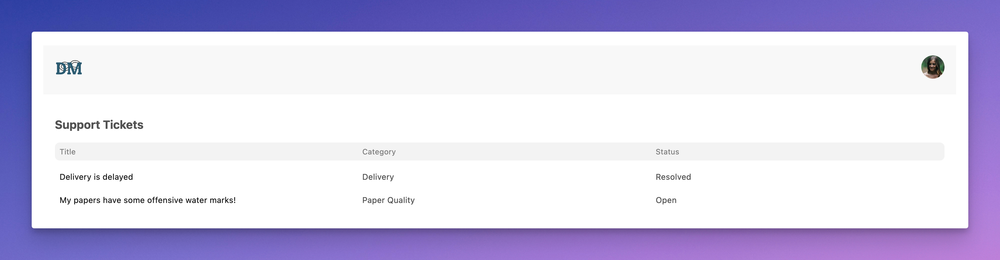
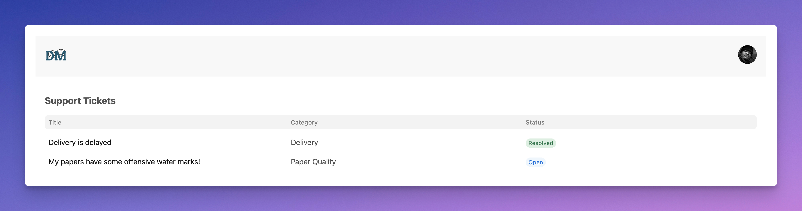

## Hands-on Assignments: Day 3

[Michael Scott](https://en.wikipedia.org/wiki/Michael_Scott_(The_Office)) has reached out for our help. He wants to digitize the customer support process for [Dunder Mifflin](https://en.wikipedia.org/wiki/Dunder_Mifflin). We (mostly you 😉) are tasked to build a very simple ticketing portal using Frappe Framework & FrappeUI. Let's start!

### Task 1: Backend Setup

Start by creating a new custom Frappe app named `simple_ticketing`. Now, create a new site and install this app on it.

### Task 2: Frontend Setup

**Step 1: New VueJS Project**

For the last time, we will manually setup a VueJS, TailwindCSS and FrappeUI based frontend app (SPA). Let's start by creating a new VueJS project inside our custom app:

```bash
cd apps/simple_ticketing
npm create vue@latest
```

> Note: we are setting up the VueJS project inside our custom app directory

Provide `frontend` when asked for a project name and `No` to everything else. Once this command has finished running, `cd` into the `frontend` directory:

```bash
cd frontend
npm install # install dependencies
npm run dev # start the development server
```

**Step 2: Setup TailwindCSS**

Follow [this guide](https://tailwindcss.com/docs/guides/vite#vue) to setup TailwindCSS in our newly created frontend project. Make sure you clean up your `App.vue` by removing the boilerplate code and test tailwindCSS is working properly by applying a few classes.

### Task 3: Setup FrappeUI

Start by installing the `frappe-ui` package:

```bash
npm install frappe-ui
```

> Note: Make sure you are running these commands inside the `frontend` directory

**Configuring TailwindCSS**

Now, open up your `tailwind.config.js` file and make the following additions:

```diff
+ import tailwindConfig from "frappe-ui/src/utils/tailwind.config";

export default {
+ presets: [tailwindConfig],
  content: [
    "./index.html",
    "./src/**/*.{vue,js,ts,jsx,tsx}",
+   "./node_modules/frappe-ui/src/components/**/*.{vue,js,ts,jsx,tsx}",
+   "../node_modules/frappe-ui/src/components/**/*.{vue,js,ts,jsx,tsx}",
  ],
  // ...
}
```

By making the above changes, we are configuring tailwind to use the design tokens (colors, sizing, etc.) from the `frappe-ui` package. You may need to restart your development server.

**Configuring Vite**

Open up `vite.config.js` file and add the following lines:

```diff
import { fileURLToPath, URL } from 'node:url'
+ import frappeui from "frappe-ui/vite";
import { defineConfig } from 'vite'
import vue from '@vitejs/plugin-vue'

// https://vitejs.dev/config/
export default defineConfig({
    plugins: [
        vue(),
+       frappeui()
    ],
    resolve: {
        alias: {
            '@': fileURLToPath(new URL('./src', import.meta.url))
        }
    },
+   optimizeDeps: {
+       include: ["frappe-ui > feather-icons", "showdown", "engine.io-client"],
+   },
})
```

We are basically importing the `frappeui` vite plugin and telling vite to use it. As discussed in the lecture, this will setup the **proper proxy-ing of our API calls to the Frappe backend / web server**. This is needed in development because... remember? Because the development server and our Frappe server run on different ports. You will have to restart your development server after this change.

The `optimizeDeps` part helps in properly building some of `frappe-ui`'s dependencies (or packages). You don't have to worry much about this.

At this point, you will be good to go! You can now try importing a few components from `frappe-ui` and start using them in your `App` component.

> Note: Access your development site using the site URL: `<site-name>:8080` instead of `localhost:8080`. This is required for the proxy-ing part.

### Task 4: Header

Your first task is to create a header for our dashboard:

<https://github.com/BuildWithHussain/vtf-training/assets/34810212/62364513-82c4-4ec3-999e-4ed4c8c1a3d1>

Start by creating a new component named `Header.vue` and add it to your `App.vue` file. Here are the requirements for the header:

1. Place [this](https://github.com/BuildWithHussain/vtf-training/assets/34810212/f2574fab-2878-4c63-a721-6e30535cd4ce) logo image on the left end of the header.

2. Since our frontend app (SPA) lives outside of the desk (Frappe's admin interface), it has become a pattern to provide *an easy way to switch back to the desk*. Use the `Avatar` & `Dropdown` component from `frappe-ui` to implement what you see in the video above.

3. You can use this cool avatar placeholder: `https://i.pravatar.cc/100` for the avatar image. The size of the avatar is `2xl`.

4. Notice the cursor (pointer) when you hover over the avatar.

### Task 5: **R**ead / List View

In order to do CRUD on our Frappe backend, we will need to first have a database table to store our support tickets, i.e. DocType time! Create a new DocType named **Support Ticket** with the following configurations:

1. Naming Rule: Auto-increment
1. Fields:
    1. Title (data, mandatory)
    1. Description (Text Editor)
    1. Status (select, default is Open) [Open, Waiting for reply, Resolved, Closed]
    1. Purchase Date (date)
    1. Category (select, mandatory) [Paper Quality, Delivery, Other]

Now, use FrappeUI's `ListView` component along with the `createListResource` utility to display the list of **Support Ticket**s from the backend! For keeping the code clean and organized, implement this in a separate component, `TicketList.vue` and add it to the root component (`App`):



> Note that I have also added an heading above the list

Here are some implementation details:

* 3 columns
* Latest tickets should be shown first (hint: look for `orderBy` in list resource docs!)
* Rows are not `selectable`
* The `LoadingText` is shown while the list data is loading

**Tip**

To keep your template clean and less verbose, you might want to define columns and rows in the scripts area:

```js
const columns = [
    // ...
]

🤔 // Think why I am using computed here!
const rows = computed(() => {
    // ...
})
```

*Optional Challenge*

Render a `Badge` for the status column instead of plain text:



> Hint: Experiment with the **Cell Slot** variant of the ListView component on frappeui.com

### Task 6: **C**reate / New Ticket

The final task for today is:

<https://github.com/BuildWithHussain/vtf-training/assets/34810212/5bf44a0f-42f9-4327-a129-42dd62e8476f>

Your task is to implement create new ticket functionality as shown above. The button (`solid`, `lg`) is on the same row as the **Support Ticket** heading (cough.. flex-box!). Clicking the button opens up a dialog (of size `2xl`) with input for title, description, category and purchase date. Here are some more details about this form:

* Title is a `FormControl` of type `text`
* Category is a `FormControl` of type `select`
* Purchase Date is a `FormControl` of type `date`

This dialog has just one action: `Create` which inserts a new ticket to our backend using the list resource you created in the previous task.

The `TextEditor` component used for capturing the description is not documented on FrappeUI website [yet](https://github.com/frappe/frappe-ui/issues/156). That is why I am providing you with the code you can use to get it working:

```vue
<TextEditor
    ref="editor"
    :fixedMenu="true"
    editorClass="prose-sm max-w-none p-2 min-h-28"
    placeholder="Describe your problem..."
    @change="val => newTicket.description = val"
/>
```

Instead of `v-model`, it has a change event listener that gives you the updated value on change of the editor contents, which we are setting to `newTicket.description`. You might have guessed that `newTicket` is a `reactive` object that I have used to store the ticket data. You can name it whatever you like.

I would suggest you to re-watch Day 3 lecture if you get stuck in this task.

*We will continue from here in the next assignment!*
