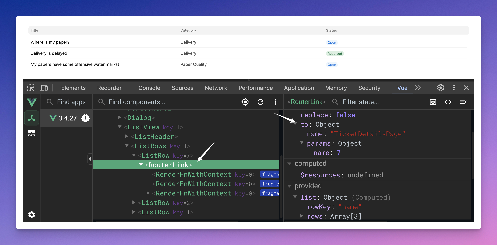

## Hands-on Assignments: Day 4

We will continue where we left of in Day 3 assignment: **Dunder Mifflin Ticketing Portal**!

Here is what we have built till now:

<https://github.com/BuildWithHussain/vtf-training/assets/34810212/5bf44a0f-42f9-4327-a129-42dd62e8476f>

Here are the tasks at hand for this sprint:

* Search and Sort in Ticket List View
* Ticket Detail View
* Setup Authentication
* Fix Header Avatar
* Knowledge Base View

Before proceeding with the assignment, it is recommended to complete the Day 4 readings.

### Task 1: Search and Sort in List View

### Task 2: Setup Vue Router

It is time to setup routing in our VueJS app. Let's start by [installing Vue Router](https://router.vuejs.org/installation.html):

```bash
npm install vue-router@4
```

Now we can configure our router in the `main.js` file. Start by adding the following import:

```js
import { createRouter, createWebHistory } from 'vue-router'
```

Then we can create a new router instance:

```js
const routes = [] // TODO: define routes

const router = createRouter({
    history: createWebHistory(),
    routes: routes
})
```

Then we will plug-in the router instance to our app:

```diff
app = createApp(App)
...
+   app.use(router)
...
app.mount('#app')
```

Now the only step remaining is to tell Vue Router where to mount the components defined for each route. Update `App.vue`'s template to have the `router-view`:

```vue
<template>
    <Header />
    <router-view />
</template>
```

You will notice that our list view is no longer being rendered. It is your task now to configure the below 2 routes:

1. '/' -> Redirect to '/tickets'

1. '/tickets' -> Should load `TicketList` component we created in day 3

Make sure you load the components lazily. Here are some docs to help you out:

* [Setting up Redirect](https://router.vuejs.org/guide/essentials/redirect-and-alias.html)
* [Lazily Loading Routes](https://router.vuejs.org/guide/advanced/lazy-loading.html)

As soon as you setup the above routes, your frontend should load the tickets list and the route should be '/tickets'!

### Task 3: Ticket Details Page

Create a new component named `TicketDetails` (`TicketDetails.vue`) and configure a new route '/tickets/:name' which Should load this component. Also, **give a name** value of `TicketDetailsPage` to this route, so we can navigate to this page using this name instead of hardcoding the path. `:name` will be the ID of the ticket whose details will be displayed.

#### Displaying the `name`

Our task is to catch and display the route parameter `name` in our ticket details page.

Hint: Use `useRoute` hook to access the route parameters.

#### Linking List Items to Details Page

It is time to link the List and the Details page. We want to navigate to a particular ticket's detail page when it is clicked (row in the list). Now, here is the interesting part, FrappeUI's `ListView` component has built in support for this!

We can just pass a `getRowRoute` function in our options prop. We get the row data as argument to this function and have to return the route we want to navigate to:

```diff
<ListView
    ...
    :options="{
        ...,
+       getRowRoute: (row) => ({ 
+           name: 'TicketDetailsPage', 
+           params: { 'name': row.name } 
+       })
    }"
/>
```

Here `row.name` is the name of the ticket. Behind the scenes, FrappeUI will turn our rows into a Router Link! We can confirm that using [Vue Dev Tools](https://devtools.vuejs.org/):



#### Displaying ticket details

Now it is your time to do some exploration and implement the details page shown below:

<https://github.com/BuildWithHussain/vtf-training/assets/34810212/60011a1a-c52c-4657-90bc-544eb367890f>

You have to use the `createDocumentResource` utility from `frappe-ui` to fetch a particular ticket document. We already have the **name** of that document/ticket in route params!

Here are some implementation details:

* The Purchase Date is formatted using a library called [`dayjs`](https://day.js.org/docs/en/installation/node-js). Install this package in your frontend app. Here is a snippet of how to import and use this package in your components:

    ```js
    import dayjs from 'dayjs'

    function getFormattedDate(dateString) {
        // dateString comes from backend, e.g. '2024-06-13'
        return dayjs(dateString).format("YOU-FIGURE-THIS-OUT")
    }
    ```

* The **Mark as resolved** button calls a whitelisted method that you have to create in your `Support Ticket` controller file:

    ```py
    class SupportTicket(Document):
        @frappe.whitelist()
        def mark_as_resolved(self):
            self.status = "Resolved"
            self.save()
            # More steps could go here, e.g. email notification.     
    ```

    Check out the documentation of `createDocumentResource` on frappeui.com to find out how you can easily work with whitelisted methods and you should be able to implement this feature in a breeze! Also, the status gets auto-updated in the frontend, FrappeUI magic!

* The description field has HTML content, figure out how to render that in the page. You can use the `prose` tailwindCSS class to get the nice styling:

    ```html
    <div class="prose">
        <!-- The description HTML should get rendered here -->
    </div>
    ```

### Task 4: Basic Authentication & Route Protection

Right now, anyone can visit all of our pages, but we don't want that. We want to give the user access to this pages only if they are logged in. For that, we need to **somehow configure Vue router to prevent navigation if the user is not logged in**. Let's start simple and see how we can use the `beforeEach` hook on our router object to attach our own logic to call before each routing happens:

```js
router.beforeEach((to, from, next) => {
    const isUserLoggedIn = ... // the part to figure out

    if (isUserLoggedIn) {
        // let them visit continue to "to"
        next()
    } else {
        // redirect them to Frappe's login page
        window.location.href = '/login'
    }
})
```

Assuming we want to protect all our routes, in the above code, we are checking if the user is logged in (we will get to this in a minute). If yes, we are calling the `next` function provided as argument to let them continue to the route they are visiting (i.e. `to`). If the user is not logged in, we will throw them to the login page.

**Figuring out session user**

Since in development our Vue frontend / SPA is running on the same host as our Frappe site (in production, it will be served on the same site!), the authentication session (cookies!) will be same. That's why the data fetching has been working till now: we were already logged in from the desk! Enough talk, let's get building! Copy paste the below function in your `main.js` file:

```js
function sessionUser() {
  const cookies = new URLSearchParams(document.cookie.split('; ').join('&'))
  let _sessionUser = cookies.get('user_id')
  if (_sessionUser === 'Guest') {
    _sessionUser = null
  }
  return _sessionUser
}
```

This function checks the cookies for the `user_id`, if it is anything other than **Guest**, it means they are logged in. This function will return `null` if the user is not logged in. 

We have the missing piece now, we can plug this into our `beforeEach` hook:

```diff
router.beforeEach((to, from, next) => {
+   const isUserLoggedIn = Boolean(sessionUser())

    if (isUserLoggedIn) {
        // let them visit continue to "to"
        next()
    } else {
        // redirect them to Frappe's login page
        window.location.href = '/login'
    }
})
```

Voila! Try logging out from desk and visiting the frontend, if you have setup everything correctly, you should be redirected to the login page.

### Task 5: Fix the Avatar


### Task 6: Knowledge Base Page

Add a new route at **'/kb'** that renders a component named `KnowledgeBase`. Here is how the `KnowledgeBase` component should look like:

[TODO]

Some things to note:

1. This should be a public route, i.e. not protected.
1.
