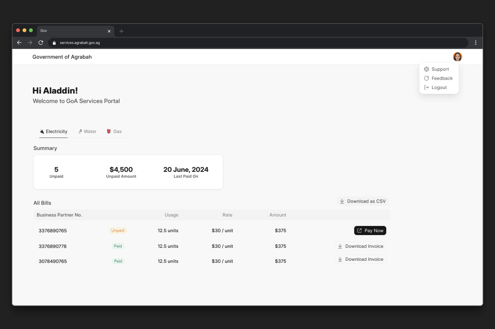
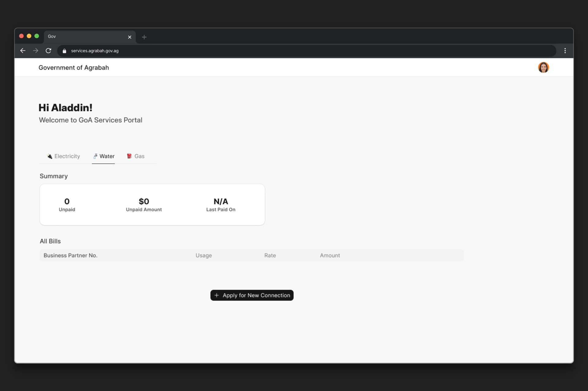
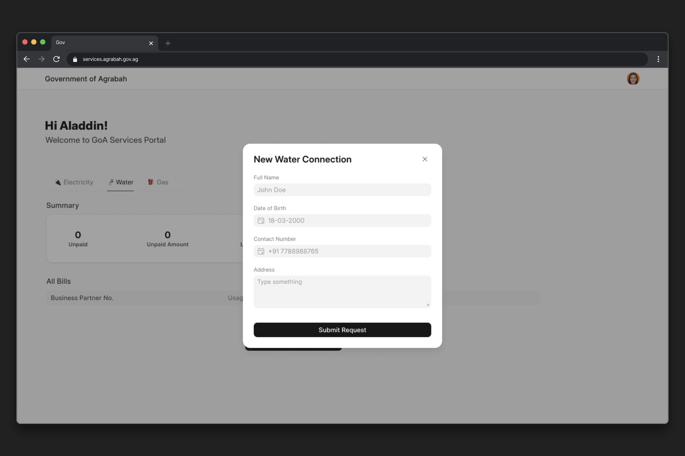
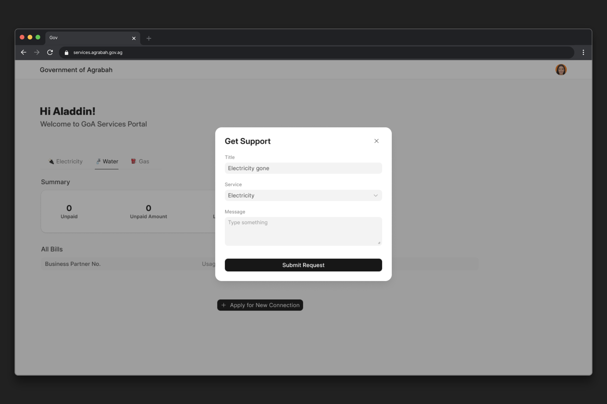

# The Final Project

> This is going to be a more open-ended project, so feel free to go above and beyond!

The Government of [Agrabah](https://en.wikipedia.org/wiki/Aladdin_(franchise)#Setting) wants to digitize their three core services: electricity, water, and gas. The public (users) should be able to use this portal to manage these services, for example, viewing and paying bills. They have reached out to you for building this portal with Frappe Framework and FrappeUI!

The government employees will use the desk (admin interface), so make sure you use the Form Builder and List View configurations properly for good UX.

## Requirements

The ministry has provided you with **User Stories and Mock-ups** for the portal. Your job is to implement the portal based on these.

> User Story ([Wikipedia](https://en.wikipedia.org/wiki/User_story)): "In software development and product management, a user story is an informal, natural language description of features of a software system. They are written from the perspective of an end user or user of a system."

### User Stories

As a portal user (citizen of Agrabah), I should be able to:

* view a list of my electricity, water, and gas bills
* view a summary of each type of the above bills: how much and how many bills are unpaid, what is the current usage, when did I pay the last bill
* click on a link to pay the unpaid bills
* download any bill as a PDF
* download the data of my bills as CSV
* request for service/complaint directly from this portal

### Mock-ups

#### Home Page

#### Water Tab / Empty State

#### New Connection Dialog

#### Support / Complaint Dialog

### Some Notes

These user stories and mock-ups are just the minimum requirements, feel free to extend and model the "bills" and "services" as you see fit (and close to real world use cases). Implement the tab navigation with Vue Router based routing (check other Frappe Apps on how they are doing it 😉).

Best of Luck! Have fun!

### 1-on-1 Review with Me! [Optional]

If you have built this project and reached to this point, I would be happy to jump on a 1-on-1 call with you and review the project. Book a slot from [here](https://cal.com/bwh.live)!
